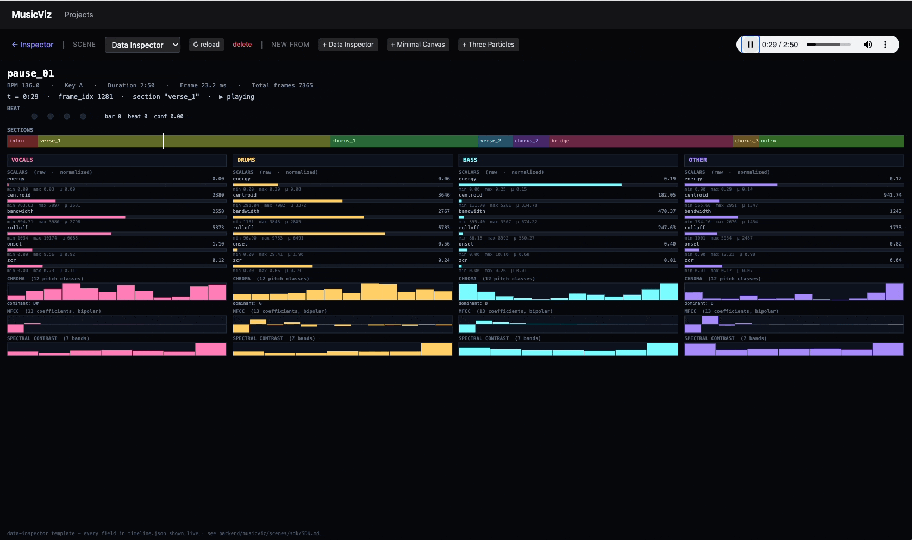

# MusicViz

Local-first music fingerprinting and visualization system.

```
music-viz/
├── backend/        Python — FastAPI server + fingerprinting pipeline
└── frontend/       React + Vite — local web UI
```

## Backend setup

```bash
cd backend
python -m venv .venv
source .venv/bin/activate
pip install -e .
python -m musicviz   # serves on http://127.0.0.1:8765
```

The first Demucs run downloads the model (~80MB) and is much faster on a CUDA GPU. CPU works fine but expect 30s–2min per song.

Project data (audio, stems, fingerprints, scenes) is stored in `./projects/` at the repo root by default and is gitignored. Override with `MUSICVIZ_PROJECTS_ROOT=/some/path`.

## Frontend setup

```bash
cd frontend
npm install
npm run dev   # serves on http://127.0.0.1:5173
```

Vite proxies `/api` and `/ws` to the backend on port 8765.


## Examples




